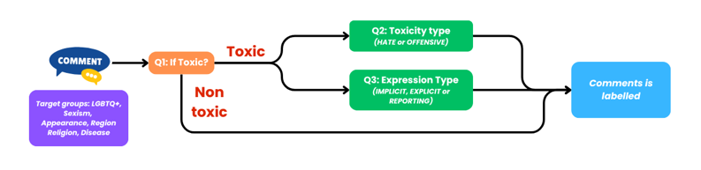
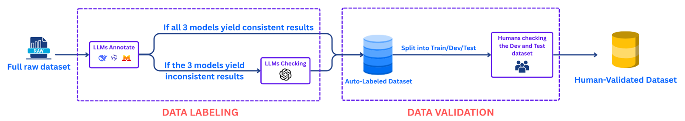

# ViToxic: A Fine-Grained Dataset and Classification Framework for Detecting Toxic Language in Vietnamese Social Media Texts

This repository contains the official implementation of the paper [*ViToxic: A Fine-Grained Dataset and Classification Framework for Detecting Toxic Language in Vietnamese Social Media Texts*]

**Disclaimer:** This project contains real comments that could be considered profane, offensive, or abusive.

---

## Introduction

The rapid growth of social media in Vietnam — with over 76.2 million accounts as of January 2025 — has brought widespread toxic language problems. Vietnam has ranked among the **top 5 countries with the worst online civility** (Microsoft Digital Civility Index, 2020), yet existing Vietnamese datasets often rely on flat labeling schemes and fail to capture implicit toxicity such as sarcasm, metaphor, and culturally embedded expressions.

We present **ViToxic**, a large-scale Vietnamese toxic language dataset built upon a **fine-grained hierarchical framework** that models toxicity across multiple dimensions:

*Figure 1. Overview of the proposed multi-level annotation framework.*

- **(Level 1)** Toxicity presence: `TOXIC` / `NON-TOXIC`
- **(Level 2a)** Target-based intent: `HATE` / `OFFENSIVE`
- **(Level 2b)** Expression type: `EXPLICIT` / `IMPLICIT` / `REPORTING`
- **Targeted groups:** Appearance · Disease · LGBTQ+ · Region · Religion · Sexism

To annotate at scale, we introduce a **semi-automatic pipeline** combining multiple LLMs (Qwen, Mistral, DeepSeek, GPT-5) with human-in-the-loop validation.

*Figure 2. Overview of the semi-automatic annotation workflow.*

---

## Dataset

ViToxic contains **43,107 Vietnamese social media comments** collected from Facebook, YouTube, TikTok, and Reddit, split as follows:

| Split | Samples |
|-------|---------|
| Train | 34,487  |
| Dev   | 4,310   |
| Test  | 4,310   |

Distribution across targeted social groups:

| Category   | Train  | Dev   | Test  | Total  |
|------------|--------|-------|-------|--------|
| Region     | 8,007  | 1,140 | 1,163 | 10,310 |
| LGBTQ+     | 7,710  | 1,048 | 1,118 | 9,876  |
| Religion   | 7,354  | 1,195 | 1,120 | 9,669  |
| Disease    | 5,951  | 286   | 329   | 6,566  |
| Appearance | 4,103  | 638   | 577   | 5,318  |
| Sexism     | 1,362  | 3     | 3     | 1,368  |
| **Total**  | **34,487** | **4,310** | **4,310** | **43,107** |

> **NOTE:** The dataset will be released upon paper acceptance. A download link will be provided here.

---

## Baselines' Performances

We evaluate models across three classification tasks. F1-score is the primary metric due to class imbalance.

**Task 1: TOXIC vs. NON-TOXIC**

| Model | Acc | F1 | Prec. | Rec. |
|---|---|---|---|---|
| TextCNN | 68.65 | 68.96 | 63.66 | 75.24 |
| XLM-R | 67.84 | 68.18 | 62.90 | 74.44 |
| mBERT | 68.10 | 69.14 | 62.60 | 77.19 |
| mT5 | 68.45 | 69.80 | 62.65 | 78.80 |
| ViSoBERT | 67.63 | 68.64 | 62.22 | 76.54 |
| CafeBERT | 69.61 | 67.59 | 66.73 | 68.47 |
| **PhoBERT** | **69.44** | **70.92** | 63.38 | 80.50 |
| BARTpho-word | 67.15 | 70.41 | 60.37 | 84.46 |
| BARTpho-syllable | 66.40 | 69.26 | 60.07 | 81.75 |
| viBERT | 68.45 | 68.82 | 63.41 | 75.24 |

**Task 2: HATE vs. OFFENSIVE**

| Model | Acc | F1 | Prec. | Rec. |
|---|---|---|---|---|
| TextCNN | 52.08 | 51.07 | 78.46 | 37.86 |
| XLM-R | 57.29 | 58.56 | 81.57 | 45.68 |
| mBERT | 57.84 | 61.26 | 77.96 | 50.46 |
| mT5 | 59.30 | 62.55 | 79.76 | 51.44 |
| ViSoBERT | 59.35 | 62.57 | 79.86 | 51.44 |
| **CafeBERT** | **63.36** | **70.42** | 75.46 | 66.01 |
| PhoBERT | 59.15 | 61.17 | 82.20 | 48.71 |
| BARTpho-word | 60.65 | 64.24 | 80.39 | 53.49 |
| BARTpho-syllable | 60.55 | 65.86 | 76.90 | 57.59 |
| viBERT | 56.09 | 56.85 | 81.04 | 43.78 |

**Task 3: EXPLICIT / IMPLICIT / REPORTING**

| Model | Acc | F1 | Prec. | Rec. |
|---|---|---|---|---|
| TextCNN | 61.50 | 45.12 | 50.85 | 44.33 |
| XLM-R | 63.31 | 53.76 | 56.80 | 52.45 |
| mBERT | 63.56 | 53.85 | 56.79 | 52.30 |
| mT5 | 63.26 | 53.04 | 53.48 | 53.65 |
| ViSoBERT | 61.65 | 50.38 | 51.30 | 49.71 |
| CafeBERT | 64.81 | 53.64 | 56.58 | 52.04 |
| **PhoBERT** | **66.37** | **56.85** | 56.59 | 57.17 |
| BARTpho-word | 63.46 | 55.16 | 57.11 | 53.78 |
| BARTpho-syllable | 59.75 | 47.41 | 48.93 | 46.52 |
| viBERT | 64.31 | 56.22 | 57.36 | 55.42 |

---

## Citation

---

## Contact

**Faculty of Information Science and Engineering, University of Information Technology, VNU-HCM, Vietnam**

`{22521526, 22521640, 22520426}@gm.uit.edu.vn` · `tinhv@uit.edu.vn` · `kietnv@uit.edu.vn`
